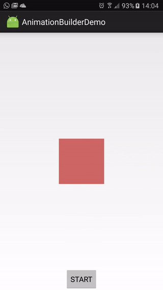

# AndroidAnimationBuilder

This tiny 'library' is supposed to help you build complex animations and behavior easily by offering a promise-like API.

Here's a simple example animation in four steps:

```java
new AndroidAnimationBuilder(animatedView)
                .rotateBy(20)
                .then().rotateBy(-40)
                .then().reset()
                .execute();
```

makes:



##

... and here is a complex example (this is the one from the demo app) to show off what can be achieved while still keeping it readable:
```java
new AndroidAnimationBuilder(v).setDefaultStepDuration(1000)
        // first step: quick preparations.
        .alpha(0).ms(10).run(view -> startButton.setEnabled(false))

        // dramatic entrance: Appear spinning
        .then().alpha(1).rotateBy(-90)

        // some more spinning fun. All those steps will take 1 second each.
        .then().rotateBy(180)
        .then().rotateBy(-285 -360)
        .then().rotateBy(15)

        // some moving fun
        .then().translateX(-1000).ms(600)

        // phew. Let's have a break
        .pause(500)

        // hop out of the screen before moving:
        // 'run(..)' is executed before the animation of the step is started
        .then().run(view -> view.setTranslationX(1500)).translateX(-1500)
        .then().translateX(0).ms(100)

        .then().translateY(-100).scaleX(2f).ms(500)
        .then().run(view -> view.setBackgroundColor(randomColor()))

        .then().rotateBy(90).scaleX(1).scaleY(3)

        // finish the show!
        // reset: Undo everything that is not defined in the step to what it was
        // before the animation was started.
        .then().reset().scaleX(0).scaleY(0).ms(2000)

        // everything back to the start
        .then().reset().ms(1).runAfter(view -> startButton.setEnabled(true))
        .execute();
```


## FAQ
### I don't need it, I can do that with *xml*!
If the xml is enough for your needs, you should definitely use the xml.
The AnimationBuilder is supposed to help in complex cases,
where a sequence of animation steps is run, probably with hooks in between.

### Huh? Isn't that what *ViewPropertyAnimators* are for?
Absolutely! The AnimationBuilder internally even uses ViewPropertyAnimators.
But with the Builder, stringing them together into a sequence and adding hooks
somewhere along the way should be much easier.